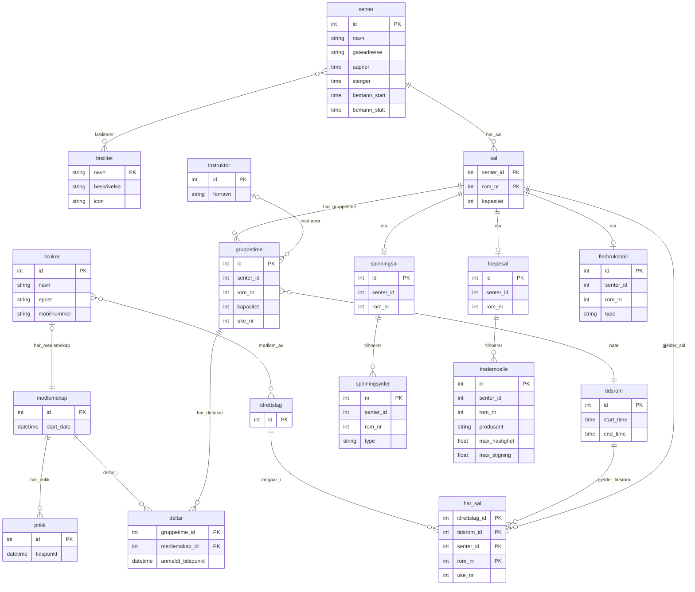

```mermaid
erDiagram
    %% Mermaid ER kan ikke tegne Chen (double box/diamond) direkte.
    %% Vi bevarer relasjonssettene med assosiative entiteter:
    %% - har_sal modellerer idrettslag <-> sal <-> tidsrom (+ uke_nr)
    %% - deltar modellerer medlemskap <-> gruppetime (+ anmeldt_tidspunkt)

    bruker {
        int id PK
        string navn
        string epost
        string mobilnummer
    }

    medlemskap {
        int id PK
        datetime start_date
    }

    prikk {
        int id PK
        datetime tidspunkt
    }

    idrettslag {
        int id PK
    }

    fasilitet {
        string navn PK
        string beskrivelse
        string icon
    }

    senter {
        int id PK
        string navn
        string gateadresse
        time aapner
        time stenger
        time bemann_start
        time bemann_slutt
    }

    sal {
        int senter_id PK
        int rom_nr PK
        int kapasitet
    }

    tidsrom {
        int id PK
        time start_time
        time end_time
    }

    gruppetime {
        int id PK
        int senter_id
        int rom_nr
        int kapasitet
        int uke_nr
    }

    instruktor {
        int id PK
        string fornavn
    }

    spinningsal {
        int id PK
        int senter_id
        int rom_nr
    }

    loepesal {
        int id PK
        int senter_id
        int rom_nr
    }

    flerbrukshall {
        int id PK
        int senter_id
        int rom_nr
        string type
    }

    spinningsykler {
        int nr PK
        int senter_id
        int rom_nr
        string type
    }

    tredemoelle {
        int nr PK
        int senter_id
        int rom_nr
        string produsent
        float max_hastighet
        float max_stigning
    }

    har_sal {
        int idrettslag_id PK
        int tidsrom_id PK
        int senter_id PK
        int rom_nr PK
        int uke_nr
    }

    deltar {
        int gruppetime_id PK
        int medlemskap_id PK
        datetime anmeldt_tidspunkt
    }

    %% Kjernemodell
    bruker o|--|| medlemskap : har_medlemskap
    medlemskap ||--o{ prikk : har_prikk
    bruker o{--o{ idrettslag : medlem_av

    %% Senter / sal / fasiliteter
    senter ||--o{ sal : har_sal
    senter o{--o{ fasilitet : fasiliterer

    %% Gruppetime-flyt
    sal ||--o{ gruppetime : har_gruppetime
    gruppetime o{--|| tidsrom : naar
    instruktor o|--o{ gruppetime : instruerer

    %% Ternary-relasjon fra original ER
    idrettslag ||--o{ har_sal : inngaar_i
    tidsrom ||--o{ har_sal : gjelder_tidsrom
    sal ||--o{ har_sal : gjelder_sal

    %% Deltakelse med relasjonsattributt
    medlemskap ||--o{ deltar : deltar_i
    gruppetime ||--o{ deltar : har_deltaker

    %% Spesialisering (disjoint i originalmodellen)
    sal ||--o| spinningsal : isa
    sal ||--o| loepesal : isa
    sal ||--o| flerbrukshall : isa

    %% Utstyr
    spinningsal ||--o{ spinningsykler : tilhoerer
    loepesal ||--o{ tredemoelle : tilhoerer
```