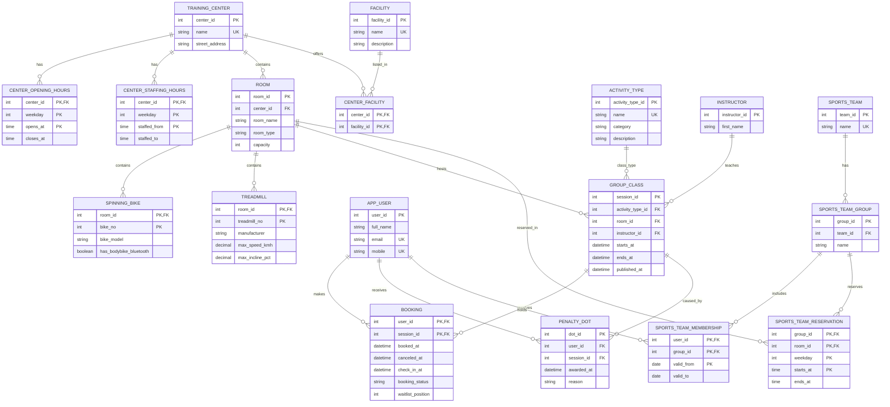

## Kommentar til modellen
- Jeg bruker **én generell `ROOM`-entitet** i stedet for subtype-hierarki for `spinningsal`, `løpesal` og `flerbrukshall`.
- Dette gjør modellen enklere å lese og lettere å oversette til SQLite-tabeller.
- Spesialutstyr (`SPINNING_BIKE`, `TREADMILL`) modelleres som egne entiteter med komposittidentifikasjon innenfor rom.
- `BOOKING` er en assosiativ entitet mellom `APP_USER` og `GROUP_CLASS`, fordi relasjonen har egne attributter.
- `PENALTY_DOT` er skilt ut fra booking fordi den representerer en sanksjonshendelse som systemet må kunne telle over tid.
- Sportslag er skilt fra ordinære gruppetimer, siden dette er to ulike forretningsprosesser.
