# Proposed ER Draft in Mermaid

This draft is intentionally cleaner than the current diagram. It keeps the assignment scope, but removes avoidable weak entities and makes the central processes easier to map to relations and SQL.

Design choices behind this draft:

- model booking as an associative entity
- use direct date-time for concrete group sessions
- keep sports-team reservations as recurring weekly reservations
- keep room subtypes because the assignment distinguishes room/equipment types
- model dots and blacklist periods explicitly because they are important in the use cases

Mermaid ER cannot express every EER detail from Chen notation, so some constraints are listed after the diagram.

```mermaid
erDiagram
    USER {
        int user_id PK
        string full_name
        string email UK
        string mobile_no
    }

    MEMBERSHIP {
        int membership_id PK
        date valid_from
        date valid_to
    }

    CENTER {
        int center_id PK
        string name UK
        string street_address
    }

    CENTER_OPENING_HOUR {
        int opening_hour_id PK
        string weekday
        time opens_at
        time closes_at
    }

    CENTER_STAFFING_HOUR {
        int staffing_hour_id PK
        string weekday
        time staffed_from
        time staffed_to
    }

    FACILITY {
        int facility_id PK
        string name UK
        string description
        string icon
    }

    ROOM {
        int room_id PK
        int center_id FK
        string room_no
        int capacity
    }

    SPINNING_ROOM {
        int room_id PK, FK
    }

    RUNNING_ROOM {
        int room_id PK, FK
    }

    MULTIPURPOSE_ROOM {
        int room_id PK, FK
        string hall_type
    }

    SPINNING_BIKE {
        int bike_id PK
        int room_id FK
        int bike_no
        bool has_bluetooth
    }

    TREADMILL {
        int treadmill_id PK
        int room_id FK
        int treadmill_no
        string manufacturer
        decimal max_speed
        decimal max_incline
    }

    ACTIVITY_TYPE {
        int activity_type_id PK
        string name UK
        string description
        bool is_spin
    }

    INSTRUCTOR {
        int instructor_id PK
        string first_name
    }

    GROUP_SESSION {
        int session_id PK
        int activity_type_id FK
        int room_id FK
        int instructor_id FK
        datetime starts_at
        datetime ends_at
        datetime published_at
        int max_participants
    }

    BOOKING {
        int booking_id PK
        int membership_id FK
        int session_id FK
        datetime booked_at
        string status
        int waitlist_position
        datetime cancelled_at
        datetime checked_in_at
    }

    DOT {
        int dot_id PK
        int booking_id FK
        datetime issued_at
        string reason
    }

    BLACKLIST_PERIOD {
        int blacklist_id PK
        int membership_id FK
        datetime starts_at
        datetime ends_at
        string reason
    }

    CENTER_VISIT {
        int visit_id PK
        int membership_id FK
        int center_id FK
        datetime checked_in_at
    }

    SPORTS_TEAM {
        int team_id PK
        string team_name UK
    }

    SPORTS_TEAM_GROUP {
        int team_group_id PK
        string group_name UK
    }

    TEAM_GROUP_MEMBERSHIP {
        int team_group_id FK
        int team_id FK
    }

    USER_TEAM_MEMBERSHIP {
        int user_team_membership_id PK
        int user_id FK
        int team_id FK
        date valid_from
        date valid_to
    }

    TEAM_ROOM_RESERVATION {
        int reservation_id PK
        int team_group_id FK
        int room_id FK
        string weekday
        time starts_at
        time ends_at
        date valid_from
        date valid_to
    }

    USER ||--o| MEMBERSHIP : has
    MEMBERSHIP ||--o{ BOOKING : makes
    MEMBERSHIP ||--o{ BLACKLIST_PERIOD : receives
    MEMBERSHIP ||--o{ CENTER_VISIT : records

    CENTER ||--o{ ROOM : contains
    CENTER ||--o{ CENTER_OPENING_HOUR : has
    CENTER ||--o{ CENTER_STAFFING_HOUR : has
    CENTER }o--o{ FACILITY : offers

    ROOM ||--o| SPINNING_ROOM : is_a
    ROOM ||--o| RUNNING_ROOM : is_a
    ROOM ||--o| MULTIPURPOSE_ROOM : is_a

    SPINNING_ROOM ||--o{ SPINNING_BIKE : contains
    RUNNING_ROOM ||--o{ TREADMILL : contains

    ACTIVITY_TYPE ||--o{ GROUP_SESSION : classifies
    INSTRUCTOR ||--o{ GROUP_SESSION : teaches
    ROOM ||--o{ GROUP_SESSION : hosts

    GROUP_SESSION ||--o{ BOOKING : has
    BOOKING ||--o| DOT : may_generate

    CENTER ||--o{ CENTER_VISIT : receives

    SPORTS_TEAM_GROUP ||--o{ TEAM_GROUP_MEMBERSHIP : contains
    SPORTS_TEAM ||--o{ TEAM_GROUP_MEMBERSHIP : belongs_to

    USER ||--o{ USER_TEAM_MEMBERSHIP : joins
    SPORTS_TEAM ||--o{ USER_TEAM_MEMBERSHIP : has_members

    SPORTS_TEAM_GROUP ||--o{ TEAM_ROOM_RESERVATION : reserves
    ROOM ||--o{ TEAM_ROOM_RESERVATION : is_reserved_in
```

## Constraints to State in the Report

These should be written as assumptions/restrictions next to the ER model, because Mermaid cannot show them all well:

1. A user has at most one active SiT membership at a time.
2. `email` is unique for users.
3. `ROOM` should also have `UNIQUE(center_id, room_no)`.
4. `SPINNING_BIKE` should have `UNIQUE(room_id, bike_no)`.
5. `TREADMILL` should have `UNIQUE(room_id, treadmill_no)`.
6. The room specialization is total and disjoint if every room must be exactly one of the listed room types. If not, say it is partial and disjoint.
7. Each group session must have exactly one activity type, one room, and one instructor.
8. `GROUP_SESSION.max_participants` should normally equal the room capacity unless the group explicitly wants to allow a smaller limit.
9. A membership may have at most one booking per session: `UNIQUE(membership_id, session_id)`.
10. `BOOKING.status` should come from a controlled set such as `BOOKED`, `WAITLISTED`, `CANCELLED`, `ATTENDED`, `NO_SHOW`.
11. A dot can only be created for a booking that ended as `NO_SHOW`.
12. Blacklisting can be derived from dots, but storing `BLACKLIST_PERIOD` is acceptable if the system needs explicit historical periods.
13. A user must be an active member of a sports team to use that team’s reserved hours.
14. Overlap checks for instructor schedules, user bookings, and room bookings are temporal constraints that are usually enforced in application logic or database triggers, not by the ER diagram alone.
15. The rules “published 48 hours before start”, “cancellation no later than 1 hour before start”, and “arrival no later than 5 minutes before start” should be documented as application/database constraints outside pure ER notation.

## Why This Draft Is Stronger

Compared with the current diagram, this version is easier to defend academically:

- the core workflow is centered on `GROUP_SESSION` and `BOOKING`
- time is attached directly to the event that actually happens
- keys are clearer
- weak entities are avoided unless truly needed
- waiting list, attendance, no-show, dots, and blacklisting can all be represented cleanly
- sports-team reservations are still included, but with simpler semantics

That is usually a better tradeoff for a strong second-year submission than an ambitious but notation-heavy ER model.
